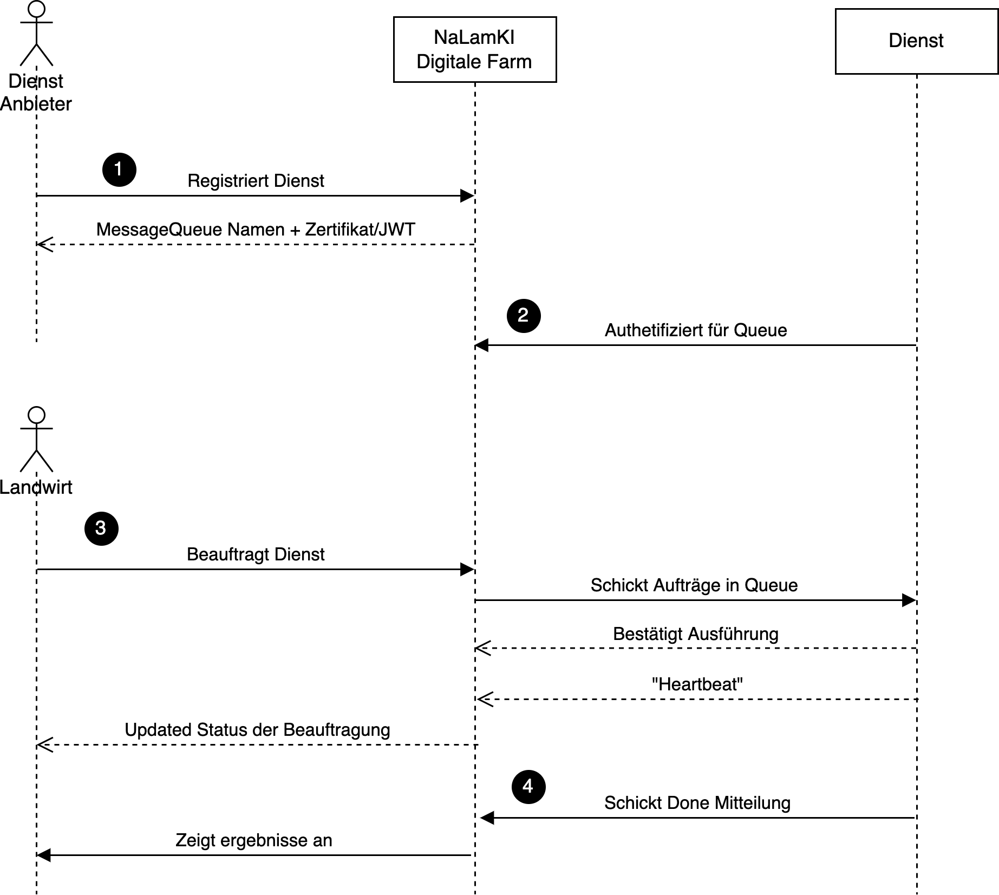

# Service Integration and Interaction

Welcome to the **Service Integration and Interaction** section of the NaLamKI SDK documentation. This section provides a thorough understanding of how services interact with the NaLamKI platform, including the roles of messaging queues, authentication mechanisms, and data handling processes.

**As a developer**, your primary focus will be on configuring your service to connect with the platform by specifying the queue name and authentication token in the configuration file. Additionally, you will learn how to update the progress status in heartbeat messages and handle errors using SDK functions, which are currently under development
> **Note:** While this section offers detailed insights into the entire integration process, developers can concentrate on the configuration and implementation parts relevant to their tasks. Refer to the **Developer Guide** subsection for specific instructions. 

### Overview
The **Service Integration and Interaction** process encompasses several key steps:

1. **Service Registration**: Registering new services on the platform.
2. **Authentication**: Securing communication between services and the platform.
3. **Service Request Handling**: Managing service requests from farmers.
4. **Job Execution and Monitoring**: Processing tasks and providing real-time updates.
5. **Execution Confirmation**: Finalizing task execution and notifying farmers of the results.

This structured approach ensures that all information is managed securely and efficiently, providing a reliable platform for both service providers and farmers.

### Detailed Workflow
 1. **Service Registration**
	>Note: Currently this step is handled by the NaLamKI administration team. To get the credentials mentioned below

    - **Description**: Service developers register a new service on the NaLamKI platform.
    - **Details**:
        - The developer sends an API call to the Service Catalog (eventually through a Developer Portal).
        - The Service Catalog creates the service with a unique UUID and generates the necessary message queues.
        - The UUID is stored in a JWT/certificate, which the service provider embeds in their service for authentication.
        - Without a valid JWT/certificate, the service cannot access the necessary queues.
1. **Authentication of Worker to the Queue**
    - **Description**: The service authenticates with the message queue.
    - **Details**:
        - The service logs into the message queue using the JWT/certificate and starts listening for messages.
        - Upon successful authentication, the worker must be registered in the backend, using the UUID, to be addressable.
2. **Service Request Handling**
    - **Description**: Farmers can request AI services through the NaLamKI platform.
    - **Details**:
        - When a farmer initiates a service request, the Digital Twin sends a message to the service’s [message queue](../faq.md#messaging-queues) (identified by the UUID).
        - The message contains all necessary commissioning information.
	        - **Input Data URL**: The URL to the [S3 storage](../faq.md#s3-storage) where the SDK can download the data to analyze.
			- **Output Data URL**: The URL to the S3 storage where the SDK will upload the analysis results.
			- **Authentication Token**: Credentials required to access the provided S3 URLs securely.
        - The worker receives the message and acknowledges it, preventing other workers from processing the same message.
        - After acknowledging, the worker begins processing and sends a confirmation that it is "working."
        - The worker then sends regular heartbeat signals to inform the Digital Twin that it is still active and processing.
        - Heartbeat information is displayed in the frontend for the farmer and includes:
            - **Completion Percentage**: Indicates how much of the task is completed.
            - **Current Processing Step**: Shows the current stage of the task.
            - **Estimated Remaining Time**: Provides an estimate of how long the process will take.
            - **Detailed Error Messages**: Offers comprehensive error information in case of failures.
3. **Execution Confirmation**
    - **Description**: Upon completing the processing, the worker confirms the execution of the task.
    - **Details**:
        - The worker sends a final confirmation or a definitive error message to the platform.
        - The results of the processing are then displayed to the farmer in the frontend.
