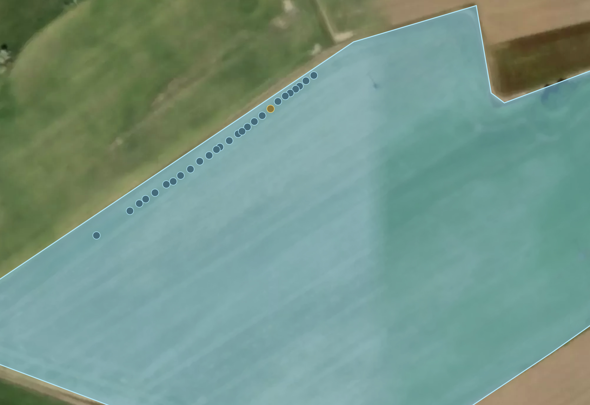
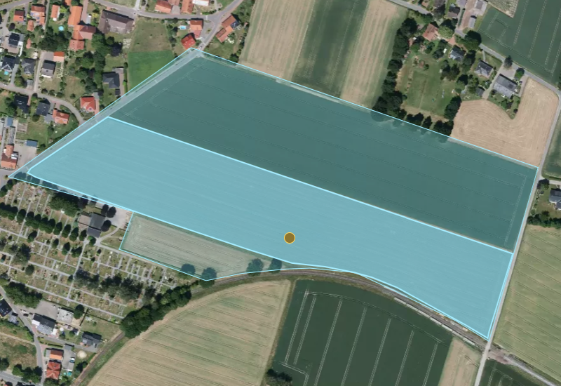
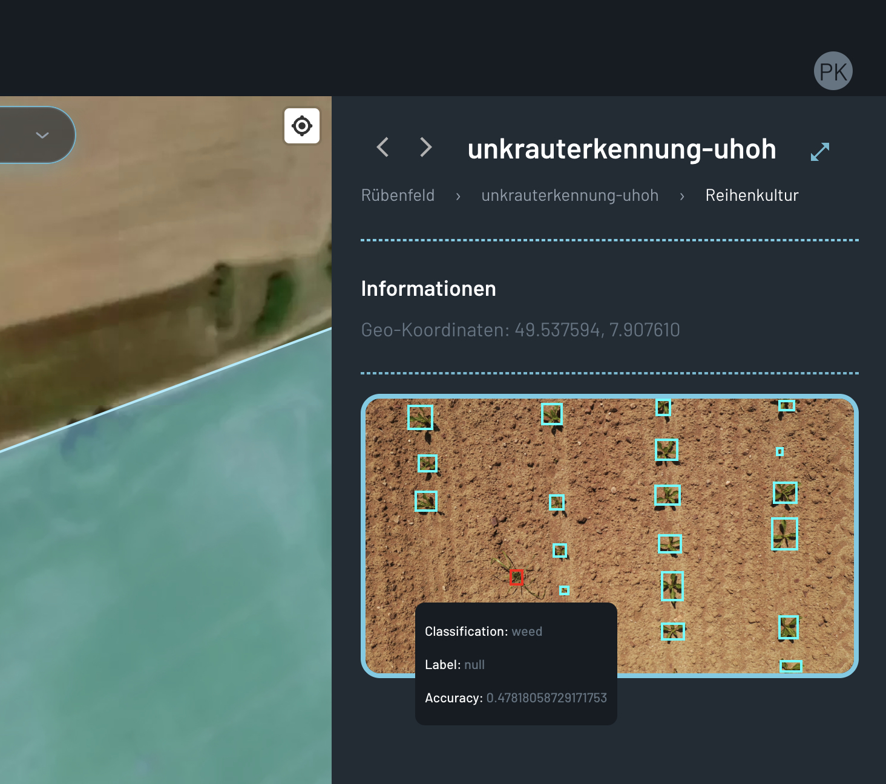
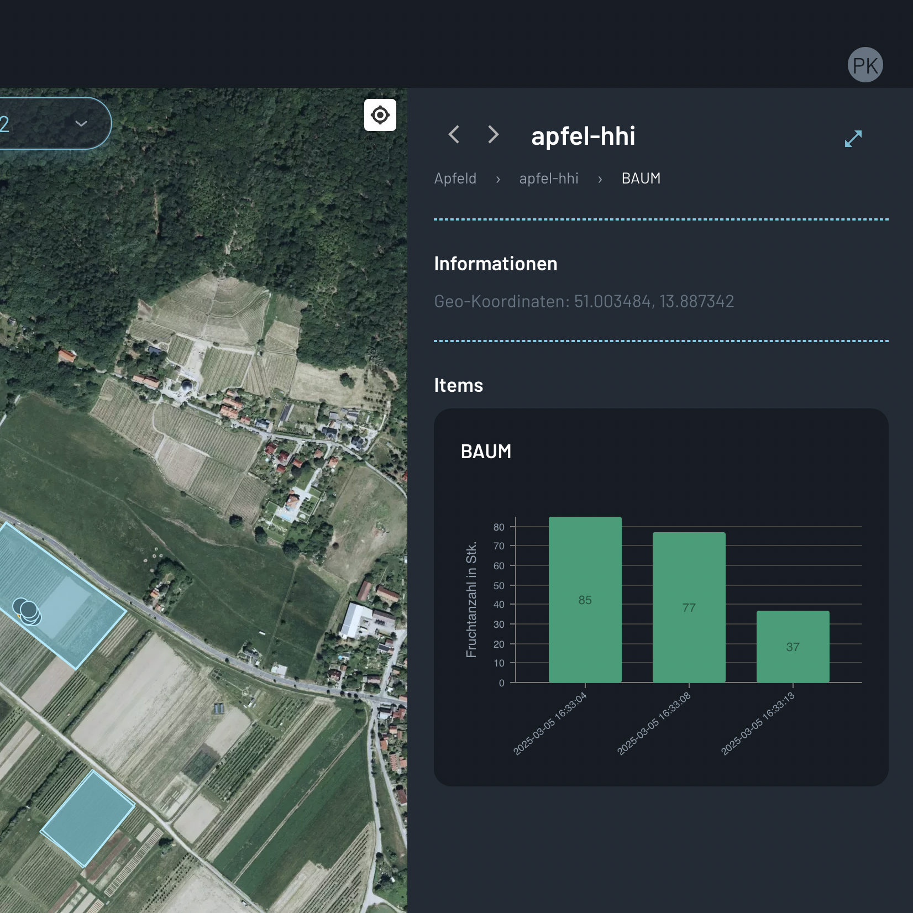
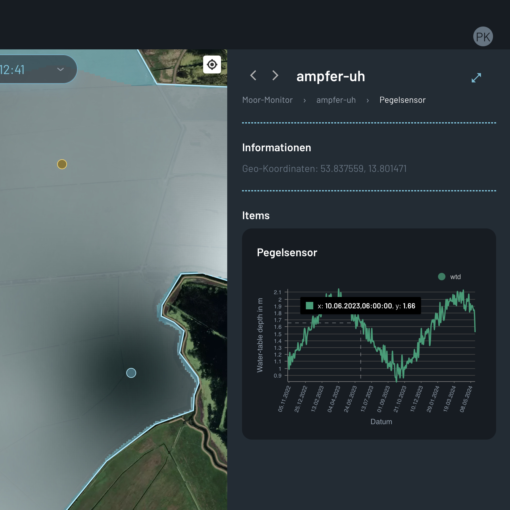
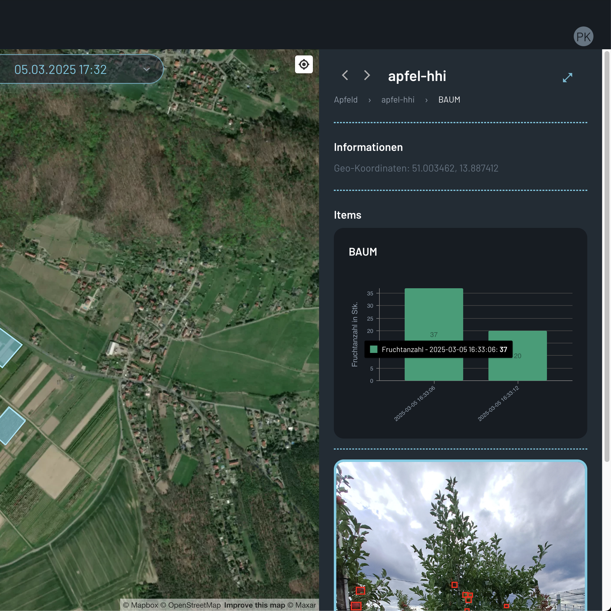
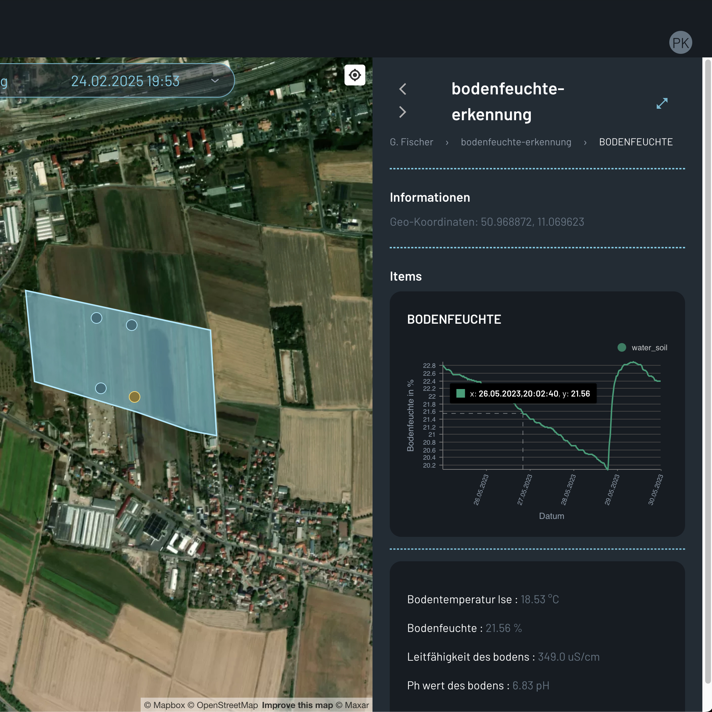
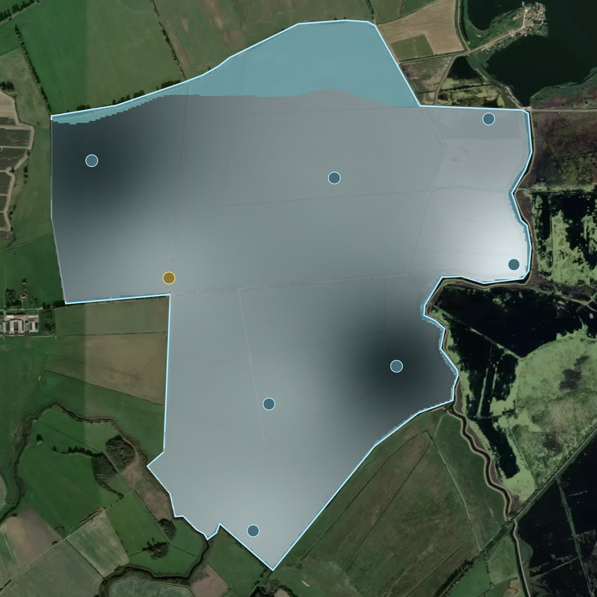

# Results Monitor

This section provides an overview over the different visualizations that can be displayed in the results monitor. The results monitor is the central place where the farmer can access the results of the AI services.

## Features

Features are objects placed on the map. This is the most basic information that can be displayed in the results monitor. The features can be of different types, defined by the GeoJSON standard. The following types are currently supported: 'Point', 'Polygon'.

  

    
<strong>Point Feature</strong>

    
    
Displays data associated with specific point locations, such as sensor readings or individual tree health.

  

  

    
<strong>Polygon Feature</strong>

    
    
Shows data aggregated or visualized across defined areas, such as field boundaries or zones of interest.

  

Each feature can be selected to display more detailed information in the sidebar. The sidebar can contain different visualizations for different feature types, defined as widgets.

## Widgets

Widgets are visualizations that can be displayed in the sidebar when a feature is selected. The following types of widgets are currently supported: 'IMAGE', 'CHART:BAR' and 'CHART:LINE', "ALPHANUM'.

### Image Widget

The image widget displays images associated with the selected feature. This can be useful for visualizing images taken at specific locations or for displaying annotated images. 
The images can contain bounding boxes, which themself can be of a specific color and annotated with additional information.

### Chart Widgets

Chart widgets can be used to visualize time series data or other numerical data associated with the selected feature. The following types of charts are currently supported: 'CHART:BAR' and 'CHART:LINE'.

  

    
<strong>Bar Chart</strong>

    
    
Displays data in a bar chart format, useful for comparing different categories or values.

  

  

    
<strong>Line Chart</strong>

    
    
Visualizes data as a line chart, useful for showing trends or changes over time.

  

## Datapoint Widgets

Datapoint widgets can be used to extend the information displayed in the chart widgets. They are displayed when a specific datapoint in the chart is selected. The following types of datapoint widgets are currently supported: 'IMAGE' and 'ALPHANUM'.

  

    
<strong>Image Datapoint Widget</strong>

    
    
Displays images associated with a specific datapoint, useful for visualizing the data behind the chart.

  

  

    
<strong>Alphanumerical Datapoint Widget</strong>

    
    
Shows additional alphanumerical information associated with a specific datapoint, useful for providing context or details.

  

## Heatmaps

It is possible to attach a heatmap to a feature. The heatmap can be used to visualize the distribution of a certain value across the feature area and will be displayed ontop of the map.

Example of a heatmap visualization showing the distribution of soil moisture across a field.
