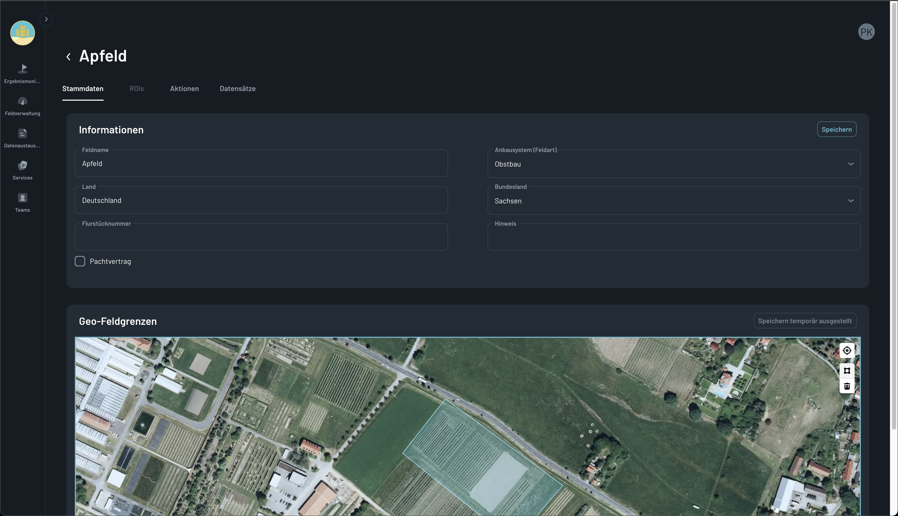
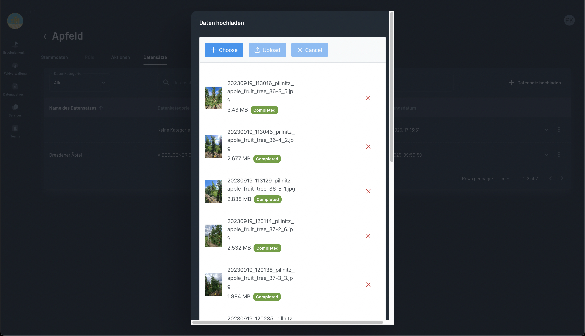
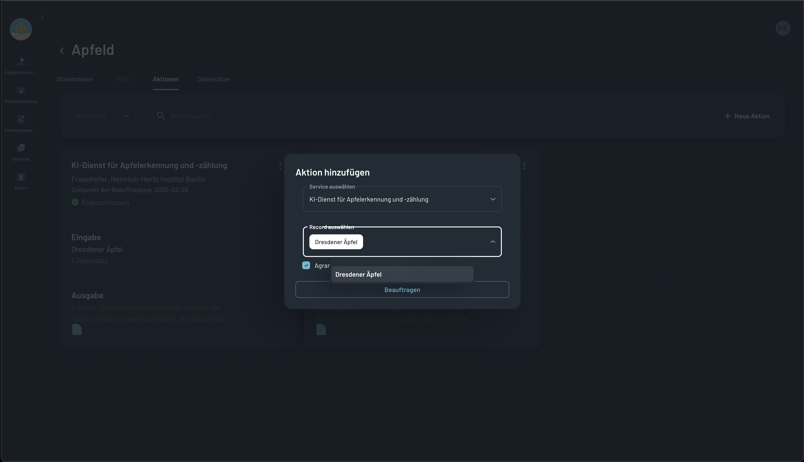
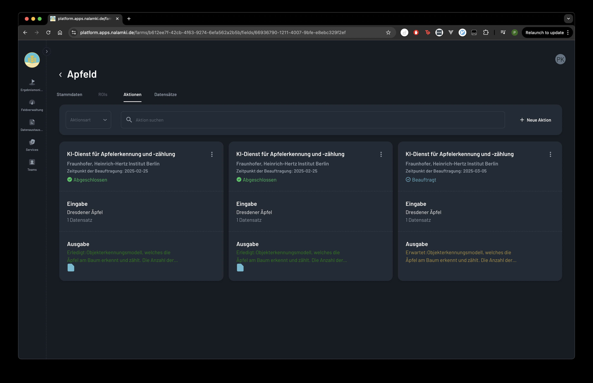
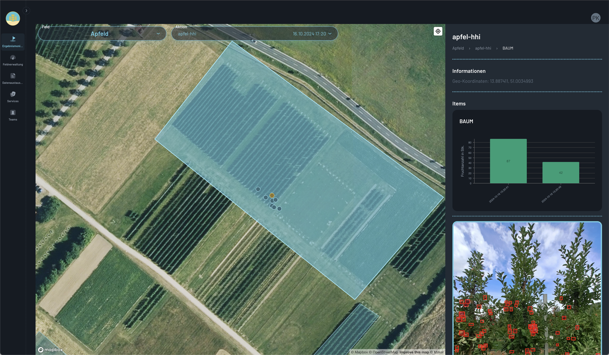

# Farmer Workflow: Utilizing AI Services on the Nalamki Platform

This section guides you through the typical workflow of a farmer using an AI service on the Nalamki platform, from data ingestion to decision-making.

<!-- TODO-1: 
### 0. Discovering and Selecting AI Services

- Action: The farmer navigates to the platform's AI service marketplace or catalog. Here, they browse a list of available AI services, reading descriptions and assessing which services align with their needs.
    >Photo Opportunity: Capture a screenshot of the "AI Service Marketplace," showcasing the list of available services with brief descriptions and icons.
- Action: After identifying a suitable service, the farmer selects it, reviewing the service's input data requirements and output data format.
-->
### 1. Setting Up the Foundation: Field and Data Management

- Action: The farmer begins by ensuring their farm and field data are accurately represented within the platform. This includes defining field boundaries, crop types, and other relevant information.
.
    >Field Management interface, showing the farmer defining field boundaries and inputting crop information.
- Action: The farmer proceeds to upload relevant sensor data or integrate data from connected devices. This could include soil moisture, weather, or other environmental data.
    
    >Data Upload interface, showing the farmer selecting and uploading files.

### 2. Applying AI Services to Field Data

- Action: The farmer selects the specific field and data sets they want to analyze using the chosen AI service.
    
    >AI Service Selection interface, showing the farmer choosing the field and data sets for analysis.
- Action: The farmer initiates the AI service processing. The platform then transmits the selected data to the AI service for analysis.
- Action: The farmer may receive progress updates or notifications during the processing phase.
    
    >Processing Updates interface, showing the farmer receiving notifications about the AI service's progress.

### 3. Analyzing and Interpreting Results

- Once the AI service has completed its analysis, the farmer accesses the results through the platform's dashboard. This may include visualizations such as graphs, charts, or maps.
    
    >Results Visualization, showcasing the output of the AI service. Additional examples can b e found in [Results Monitor](./results_monitor.md).
- The farmer carefully examines the results, paying attention to key insights and trends.

# Key Considerations for AI Developers

Ensure your AI service integrates seamlessly with this farmer workflow.
Design your service to be intuitive and user-friendly.
Provide clear and actionable insights that empower farmers to make informed decisions.
Consider how to best represent your data in the dashboard, so that it is easy to understand.
